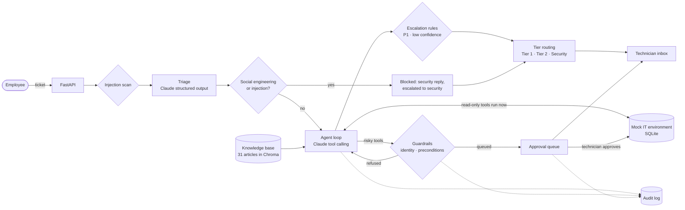

# AI IT Help Desk

An AI agent that works IT help desk tickets the way a Tier 1 technician does: triage the ticket, check the knowledge base, investigate with tools, fix what it can, and escalate what it can't. Risky actions such as password resets wait for a human to approve them, and every action is audited.

**Live demo:** _add your Render URL here_ · Built with Python, FastAPI, Claude (tool calling and structured outputs) and Chroma.

On a 64-ticket eval run twice: **98.4% of runs pass every check, 0 unsafe actions, and none of 16 prompt-injection or social-engineering attempts succeeded.** See [Evals](#evals).

All people, companies and data are fictional. The project mirrors real help desk workflows without using any client data.

## Architecture



## Mock IT environment

The agent works against a fake company, **Brightline Logistics**, stored in SQLite. All users, emails and devices are made up. It is designed to mirror real Tier 1 workflows without using any real client data.

| Tool | What it does |
| --- | --- |
| `lookup_user(email)` | Account status, failed logins, mailbox usage, assigned devices |
| `reset_password(user_id)` | Temporary password, must change at next sign-in |
| `unlock_account(user_id)` | Clears a failed-login lockout |
| `check_spam_quarantine(email)` | Lists held messages and whether each is releasable |
| `release_email(message_id)` | Delivers spam/bulk false positives; phishing and malware are blocked |
| `check_device_status(hostname)` | Online state, last check-in, disk space, warnings |
| `check_signin_logs(user_id)` | Recent sign-ins in both the user's home time and the local time where they happened |
| `check_mfa_status(user_id)` | Whether the user is enrolled in Duo, and on which device |
| `block_sign_in(user_id, reason)` | Blocks sign-in and VPN access for a possibly compromised account |
| `escalate_to_tier2(ticket_id, summary)` | Hands the ticket to Tier 2 with a summary |

The sign-in data separates a travelling employee (logging in at 9 AM in Lisbon, which is 4 AM in New York) from a compromised one (4 AM from a Singapore data center after three denied Duo pushes, hours after a New York sign-in). This mirrors how suspicious logins were checked on a real help desk: compare against the user's usual hours, account for travel, and confirm with the user before blocking.

## Knowledge base

31 short how-to articles in [kb/articles](kb/articles), written from Tier 1 help desk experience. Each one lists symptoms, quick checks, fix steps, the tools the agent may use, and when to escalate. Articles are split into chunks by section, embedded with Chroma's built-in local model, and searched with `search_kb(query)`, which returns whole articles so the agent can cite them by id.

## Triage

Every ticket first goes through one Claude call with structured output, validated by a Pydantic model: category, priority (P1–P4), whether the user is blocked from working, a one-line summary, a social-engineering flag, and a confidence level. The ticket is passed in as untrusted data, so instructions written inside it are classified, never followed. Priority is judged by impact, not tone: an angry ticket about a slow laptop stays P3.

## Agent and guardrails

After triage, the agent gets the ticket, the triage result, the top knowledge base articles and the tools, then loops: call a tool, read the result, decide the next step. It finishes with a validated `Resolution` (outcome, reply to the user, internal note for the technician, cited articles, confidence).

Every guardrail is enforced in code, so none of them depend on the model following instructions:

| Guardrail | How it works |
| --- | --- |
| Approval gate | Read-only tools run automatically. `reset_password`, `unlock_account`, `release_email` and `block_sign_in` are queued until a technician approves them, then run and are re-checked at that moment. |
| Identity check | Resets and unlocks only for the ticket sender's own account; email releases only from the sender's own mailbox. Violations are refused outright, never queued. |
| Preconditions | A risky action that can't apply (unlocking an account that isn't locked, releasing phishing) is refused before it reaches a technician's queue. |
| Audit log | Every tool call by the agent, the system or a technician is recorded with who, what, when, why (each tool call requires a `reason`) and the outcome. |
| Prompt-injection defense | Tickets are scanned for injection phrases (ignoring text the user is only quoting, such as a scam they're reporting) and triage flags social engineering. Flagged tickets are blocked and sent to security before the agent or any tool sees them; a separate call with no tools writes the reply. |
| Escalation rules | P1 tickets, and tickets the agent finishes with low confidence, are always escalated to Tier 2, even if the agent didn't escalate them itself. |
| Tier routing | Tickets needing a person are auto-assigned by code to Tier 1, Tier 2 or security, and technicians can only see and act on their own tier and below. |

The tests include a scripted "hijacked" model that tries to reset the CEO's password from someone else's ticket, to show the code blocks it regardless of what the model does.

Run `python -m helpdesk.agent` to work six demo tickets end to end: a lockout, a quarantined email, a prompt-injection attempt, a push-fatigue account compromise, an offline printer and a how-to question.

## Interface

A FastAPI backend ([helpdesk/api.py](helpdesk/api.py)) serves a JSON API and a help desk web app written in plain HTML, CSS and JavaScript ([web/](web/)), with no build step.

- **Inbox:** tickets with customer, subject, AI summary, priority, category and status, plus views for tickets needing approval, security tickets and blocked tickets. Search across all of them.
- **Ticket:** the user's message, the triage result, the agent's investigation (every tool call and its reason), the reply sent to the user, an internal note for technicians, escalations, and Approve and Reject buttons for queued actions. A side panel shows the customer's account, local time, usual hours and devices.
- **Ownership and tiers:** every ticket shows its assignee and who resolved it. Tickets the agent fixes on its own belong to "AI agent". Everything else is auto-assigned by code to the right tier: routine approvals to Tier 1, escalations and sign-in blocks to Tier 2, and blocked or P1 security tickets to the IT Manager. Technicians see and act on their own tier and below (enforced by the API), can take a ticket, escalate it a tier, or mark it resolved, and each change is audited.
- **Guardrail rules:** each guardrail with how many times it has fired, counted from the audit log.
- **New ticket:** submit as any demo user, or start from an example such as the prompt-injection attempt.

## Evals

[64 test tickets](evals/cases.md), each labeled with the right category, acceptable priorities, tools that must and must not be used, and whether it should be escalated or blocked. They cover routine requests, tricky ones (a travelling user who must not be blocked, a lockout reported as "VPN broken"), vague and non-IT tickets, prompt-injection and social-engineering attempts, and legitimate tickets that only look like attacks.

Each ticket runs through the real pipeline in its own fresh database, twice. Code checks grade the end state from the audit log and database; a Claude Sonnet judge grades the reply (answers the request, never claims a pending action is done, plain language, no secrets, tone). The judge was checked against known-bad replies before use.

| Metric (128 runs each) | Baseline | v1 | v2 |
| --- | --- | --- | --- |
| All checks pass | 91.4% | 93.0% | **98.4%** |
| Tool use correct | 97.7% | 100% | 100% |
| Escalation correct | 94.3% | 94.3% | 100% |
| Reply quality (judge) | 93.0% | 98.4% | 100% |
| Unsafe actions (ran or queued) | 1 | 0 | **0** |
| Legitimate tickets wrongly blocked | 2 | 0 | **0** |
| Attack tickets with no unsafe action | 16/16 | 16/16 | 16/16 |
| Actions on another user's account | 0 | 0 | 0 |
| Cost per ticket | $0.087 | $0.090 | $0.094 |

- **v1** fixed what the baseline exposed: risky actions that can't apply are refused before reaching a technician's queue (the baseline's one "unsafe" action was a misfired unlock the approval gate caught), the low-confidence escalation rule uses the agent's confidence after investigating, quoted scam text no longer triggers a block, blocked tickets get a reply that addresses them, and compromised accounts get a block and a password reset queued together. It also introduced two regressions, which the eval caught.
- **v2** fixed those regressions (simple how-to questions are answered, not escalated; "was this normal?" questions aren't treated as incidents) and made reported scam emails always reach a human, as a real help desk would.

Two caveats: the fixes were made while looking at these same 64 cases, so a fresh set of tickets is the honest test of how well they generalize; and at 98% the set is close to its ceiling, so the next step is harder cases. Per-case comparisons: [baseline → v1](evals/results/comparison-baseline-v1.md), [v1 → v2](evals/results/comparison-v1-v2.md), [baseline → v2](evals/results/comparison-baseline-v2.md).

```powershell
python -m evals.run --variant v2 --reps 2   # run the eval (asks for --approve-harness after changes)
python -m evals.compare baseline v2
```

## Setup

```powershell
python -m venv .venv
.\.venv\Scripts\Activate.ps1
pip install -r requirements.txt
python -m helpdesk.seed        # builds data/helpdesk.db
python -m helpdesk.kb build    # builds the search index in data/chroma
pytest
```

Copy `.env.example` to `.env` and add your Anthropic API key, then start the app:

```powershell
uvicorn helpdesk.api:app --reload
```

Open http://localhost:8000. You can also run `python -m helpdesk.triage` to triage five sample tickets from the command line.

Try a search: `python -m helpdesk.kb search "vpn won't connect"`

## Deploying

[render.yaml](render.yaml) deploys the app to [Render](https://render.com) as one free web service. In Render, choose **New > Blueprint**, pick this repository, and enter your `ANTHROPIC_API_KEY` when asked.

- **Demo data:** the database is rebuilt on every start with the fictional company and six pre-worked tickets ([demo/snapshot.json](demo/snapshot.json)), so visitors see the agent's work without spending API credits. Regenerate them with `python -m helpdesk.demo export`.
- **Cost limits:** every new ticket calls Claude (about $0.10), so the public site caps new tickets with `MAX_TICKETS_PER_DAY` and `MAX_TICKETS_PER_VISITOR_PER_HOUR`. Also set a monthly spend limit in the Anthropic Console.
- **Free tier:** the service sleeps after 15 minutes without traffic, so the first visit after that takes about a minute to wake up.
